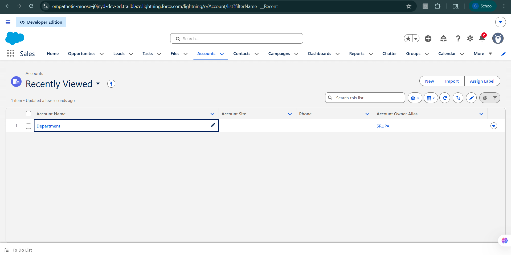
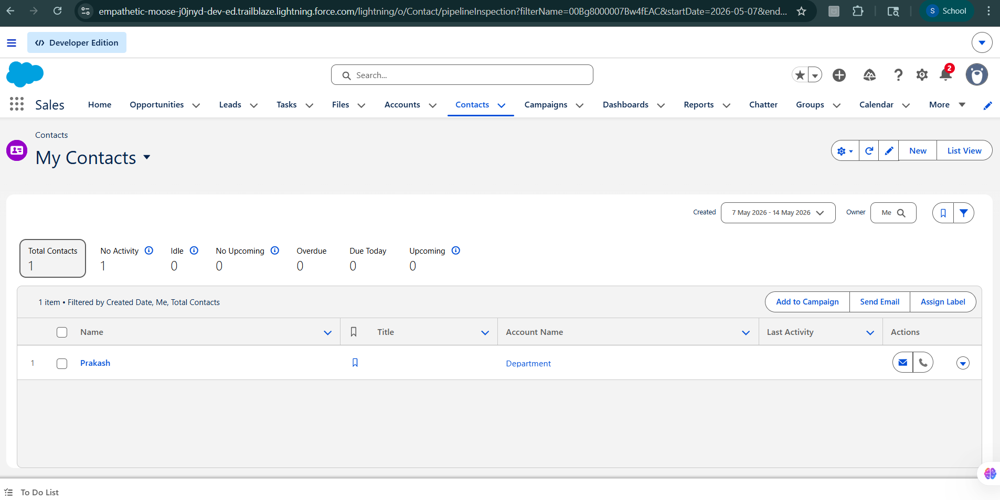
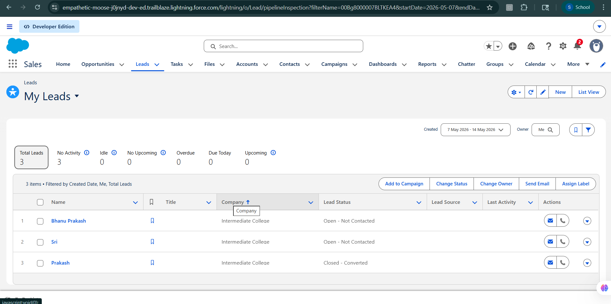
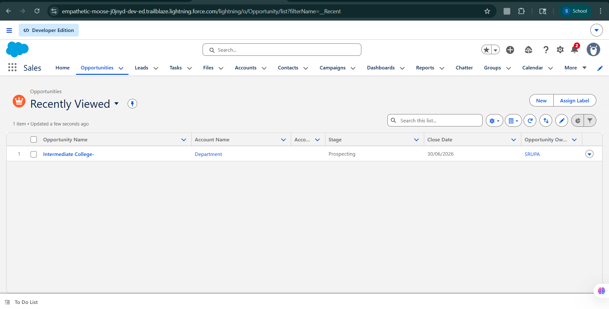

# 🚀 Day 1: Salesforce Foundations & CRM Basics

---

# 📝 Summary

The goal of Day 1 is to establish the theoretical and practical foundation of Salesforce and Customer Relationship Management (CRM).
This includes understanding the Salesforce ecosystem, Salesforce products, CRM concepts, and the Salesforce data model used for managing customer relationships and business operations.
Additionally, a simple College Admission Management workflow was explored using Salesforce standard CRM objects.

📌 Along with this, detailed learning notes and screenshots have been maintained in this repository for reference and revision purposes.

---

# 🚀 Approach Taken

### Salesforce Fundamentals
Studied the fundamentals of Salesforce as a cloud-based CRM platform used for sales, customer service, marketing, and business automation.

### Role Understanding
Understood the responsibilities and differences between Salesforce Admin and Salesforce Developer roles.

### CRM Understanding
Explored Customer Relationship Management (CRM) concepts and understood how Salesforce helps businesses manage customer interactions efficiently.

### Salesforce Data Model
Learned Salesforce Objects, Records, and Fields along with standard objects such as Account, Contact, Lead, and Opportunity.

### Platform Exploration
Explored the Salesforce interface, Trailhead platform, and Salesforce Playground environment for hands-on learning and practice.

### Hands-On CRM Workflow
Implemented a simple College Admission Management workflow using Salesforce standard objects

---

# 📘 1. What is CRM?

Customer Relationship Management (CRM) is a system used to manage a company’s interactions with current and potential customers.
It helps organizations store customer data, track communication, manage sales processes, and improve customer relationships.
CRM ensures better organization, faster decision-making, and improved customer satisfaction.

# 🏢 2. Why Companies Use Salesforce?

Companies use Salesforce because it provides:
- Cloud-based CRM platform (no installation required)
- Centralized customer data management
- Automation of sales and business processes
- Better tracking of leads, contacts, and opportunities
- Real-time reporting and dashboards
- Improved customer service and engagement
- Scalable solution for all business sizes
Salesforce helps organizations increase productivity and make data-driven decisions.

# 📊 3. Salesforce Core Objects

### 📌 Lead
A Lead represents a potential customer or enquiry who has shown interest in a product or service but is not yet qualified.
It is the starting point of the Salesforce sales process.

### 📌 Account
An Account represents a company, organization, or institution that a business deals with.

### 📌 Contact
A Contact represents an individual person associated with an Account.

### 📌 Opportunity
An Opportunity represents a potential business deal or process, such as a sale or admission.

### 🔁 CRM Flow
Lead → Account / Contact → Opportunity

---

# 📊 Real-World Mapping (College Admission Workflow)

I implemented a simple College Admission Management system using Salesforce objects:
- Lead → Student enquiry
- Contact → Registered student
- Account → Department
- Opportunity → Admission process
  
This helped in understanding how real business processes are mapped in Salesforce CRM.

---

# 🛠 Key Technical Concepts

### Salesforce CRM
Understanding how Salesforce manages customer relationships, business processes, and organizational workflows.

### Object-Based Architecture
Learning how Salesforce stores and organizes data using Objects, Records, and Fields.

### Standard Salesforce Objects
Exploring commonly used objects such as Account, Contact, Lead, and Opportunity.

### Cloud-Based Platform
Understanding Salesforce as a cloud platform accessible from anywhere without local installation.

### Trailhead Learning Platform
Using Trailhead and Salesforce Playground for practical learning and hands-on exercises.

### CRM Workflow
Understanding the real-time CRM flow using Lead → Contact → Account → Opportunity.

---

# Screenshots

### Sales App Home & App Launcher

### Account Records

### Contact Records

### Lead Records

### Leads Conversion

### Opportunity Records

---

# 💡 Learnings

- Understood how Salesforce simplifies customer relationship management for businesses.
- Gained knowledge about Salesforce products and their real-world applications.
- Learned the importance of CRM in improving customer experience and business productivity.
- Explored Salesforce’s object-based data structure and platform architecture.
- Learned the difference between Salesforce Admin and Salesforce Developer responsibilities.
- Understood Salesforce core values and the concept of business as a platform for change.
- Explored Salesforce standard CRM objects through a College Admission Management workflow.
- Practiced lead creation, lead conversion, contact management, and opportunity tracking in Salesforce.

---

# ✅ Final Outcome

Successfully understood and implemented basic Salesforce CRM concepts through both theoretical learning and hands-on practice in Trailhead and Salesforce Playground.
