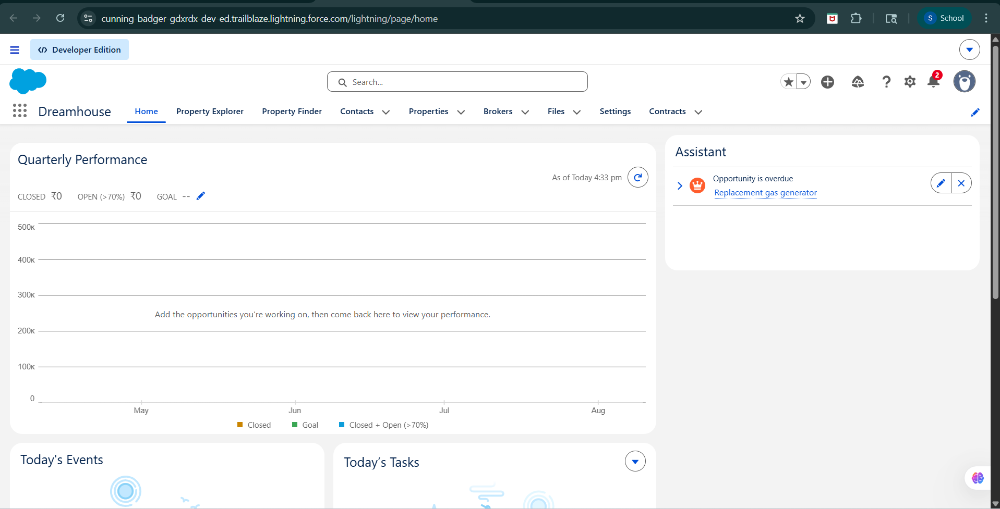
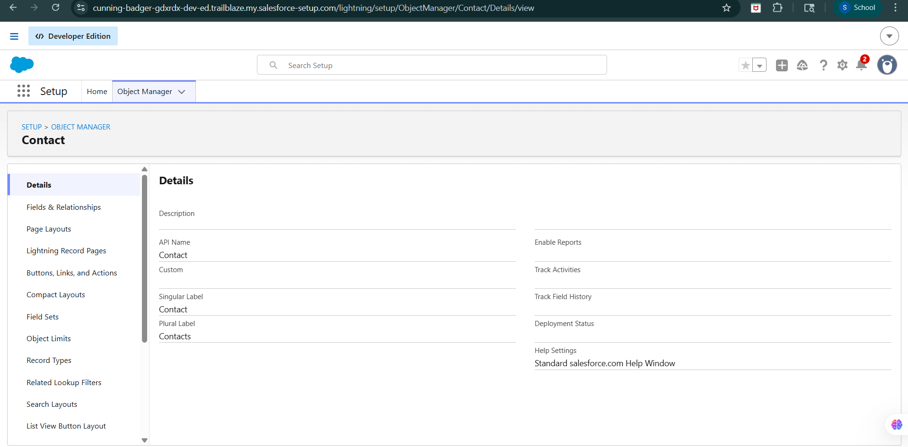
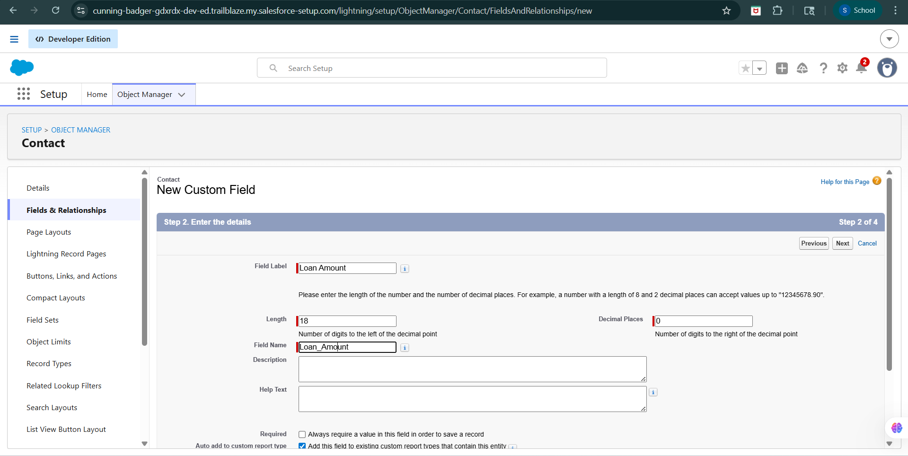

# 🚀 Day 2: Salesforce Platform Basics & Development Basics

## 📝 Summary

The goal of Day 2 is to understand how the Salesforce Platform works internally, including the structure of Apps, Objects, Tabs, and Salesforce architecture. This also includes understanding how developers build and extend applications on Salesforce using configuration tools and coding technologies such as Apex and APIs.

📌 Along with this, platform exploration, architecture understanding, and system design thinking were explored using a College Admission Management System example.

---

# 🚀 Approach Taken

## Salesforce Platform Understanding
Studied the overall Salesforce platform structure including:
- Apps
- Objects
- Tabs
- Records
- Fields
- Automation tools

## Platform Navigation
Explored the Salesforce interface, App Launcher, navigation tabs, and Object Manager.

## CRM to Platform Mapping
Understood how CRM concepts such as Accounts, Contacts, Leads, and Opportunities are implemented using Salesforce Objects and Apps.

## Salesforce Architecture
Learned about Salesforce multi-tenant architecture and how Salesforce provides scalable cloud-based services.

## Development Basics
Explored the basics of Salesforce development including:
- Configuration (No Code)
- Coding using Apex
- APIs
- Lightning Platform

## Platform Exploration
Explored Salesforce Object Manager and Fields & Relationships section to understand how Salesforce allows customization of standard objects using configuration tools.

Created and explored custom field creation workflow inside the Contact object to understand Salesforce platform extensibility and metadata-based architecture.

## System Design Thinking
Designed a conceptual College Admission Management App using Salesforce platform concepts.

---

# ☁️ 1. What is Salesforce Platform?

Salesforce is a cloud-based CRM and application development platform used to manage:
- Customers
- Sales
- Services
- Business processes
- Enterprise applications

The platform provides:
- Data storage
- Automation
- Security
- Reports and dashboards
- APIs
- Development tools

Salesforce allows organizations to build scalable business applications without managing infrastructure or servers.

---

# 🏗️ 2. Salesforce Platform Structure

Salesforce platform is structured using:
- Apps
- Objects
- Tabs
- Records
- Fields
- Automation tools
- Security controls

These components work together to manage business workflows and data efficiently.

---

# 📱 3. What is an App?

An App in Salesforce is a collection of:
- Tabs
- Objects
- Reports
- Dashboards
- Features

Apps are designed for specific business workflows.

## Examples
- Sales App
- Service App
- College Admission Management App

Apps help users organize and access related business functionalities in one place.

---

# 📦 4. What is an Object?

An Object is like a database table used to store related information.

Objects contain:
- Records (rows)
- Fields (columns)

## Types of Objects

### Standard Objects
Prebuilt Salesforce objects.

Examples:
- Account
- Contact
- Lead
- Opportunity

### Custom Objects
Objects created based on business requirements.

Examples:
- Student
- Course
- Faculty
- Fee Payment

---

# 🧭 5. What is a Tab?

A Tab is a navigation component used to access:
- Objects
- Reports
- Dashboards
- Applications

Examples:
- Accounts Tab
- Contacts Tab
- Opportunities Tab

Tabs help users navigate easily within Salesforce.

---

# 🔄 6. CRM Concepts in Salesforce Platform

CRM concepts are implemented in Salesforce using standard objects.

| CRM Concept | Salesforce Object |
|---|---|
| Student Enquiry | Lead |
| Registered Student | Contact |
| Department | Account |
| Admission Process | Opportunity |

These objects are grouped together inside Apps to support complete business workflows.

---

# 🏢 7. Salesforce Multi-Tenant Architecture

Salesforce uses multi-tenant architecture.

This means:
- Multiple organizations share the same infrastructure
- Data remains secure and isolated
- Salesforce manages updates and maintenance automatically

## Advantages
- Scalability
- Low infrastructure cost
- Automatic upgrades
- High availability

---

# ⚙️ 8. Configuration vs Coding

Salesforce development happens in two ways:

| Configuration | Coding |
|---|---|
| No programming required | Requires programming |
| Faster implementation | Used for advanced business logic |
| Uses built-in tools | Uses Apex and APIs |
| Admin-friendly | Developer-focused |

---

## 🔹 Configuration (No Code)

Using built-in Salesforce tools without programming.

### Tools Used
- Flow Builder
- Validation Rules
- Process Builder
- Formula Fields
- Object Manager

### Examples
1. Auto email notification
2. Form validation

---

## 🔹 Coding (Apex Development)

Used for advanced business requirements.

### Technologies
- Apex
- Lightning Web Components (LWC)
- APIs
- SOQL

### Examples
1. Payment gateway integration
2. Advanced approval workflow

---

# 👨‍💻 9. Salesforce Development Basics

Developers extend Salesforce functionality using:
- Apex
- APIs
- Lightning Components
- Custom Objects
- Automation tools

This allows businesses to build customized enterprise applications on Salesforce.

---

# 🏫 10. College Admission Management System Design

To understand Salesforce platform structure, a conceptual College Admission Management system was analyzed using Salesforce Apps, Objects, Tabs, and configuration tools.

---

## 📱 App Name
College Admission Management App

---

## 📦 Standard Objects Used

| Salesforce Object | Real-World Mapping |
|---|---|
| Lead | Student enquiry |
| Contact | Registered student |
| Account | Department |
| Opportunity | Admission process |

---

## 📦 Custom Objects (Conceptual Understanding)

| Custom Object | Purpose |
|---|---|
| Student | Store student details |
| Course | Store course information |
| Faculty | Store faculty details |
| Fee Payment | Store payment records |
| Attendance | Store attendance details |

---

## 👥 User Interaction

### Admin
- Manage admissions
- Verify applications
- Generate reports

### Faculty
- Manage student records
- Update attendance

### Students
- Submit applications
- Check admission status

Users interact through:
- Tabs
- Forms
- Reports
- Dashboards

---

# 🛠 Key Technical Concepts

## Salesforce Platform
Understanding how Salesforce provides CRM services and application development capabilities.

## App-Based Architecture
Learning how business processes are organized using Apps and Objects.

## Multi-Tenant Architecture
Understanding how Salesforce supports multiple organizations on shared infrastructure securely.

## Configuration vs Coding
Understanding when to use low-code tools and when advanced programming is required.

## Salesforce Development Tools
Exploring Apex, APIs, Lightning Platform, and automation tools.

## Object Manager & Customization
Explored Salesforce Object Manager and Fields & Relationships section to understand how standard objects can be customized using configuration tools.

---

# 📸 Screenshots

## Dreamhouse App Home

## Object Manager – Contact Object

## Custom Field Creation

---

# 💡 Learnings

- Understood how Salesforce platform is structured internally.
- Learned the purpose of Apps, Objects, and Tabs.
- Explored how CRM concepts fit into Salesforce architecture.
- Understood Salesforce multi-tenant cloud architecture.
- Learned the difference between configuration and coding.
- Explored Salesforce development fundamentals.
- Learned how developers extend Salesforce functionality.
- Designed a real-world College Admission Management system using Salesforce platform concepts.
- Explored Salesforce Object Manager and metadata structure.
- Learned how custom fields are created using configuration tools.
- Understood Salesforce platform extensibility using no-code customization.
- Explored Fields & Relationships for object customization.

---

# ✅ Final Outcome

Successfully understood the Salesforce platform structure, architecture, and development basics through theoretical learning, Trailhead exploration, platform customization, and real-world system design thinking using a College Admission Management example.
