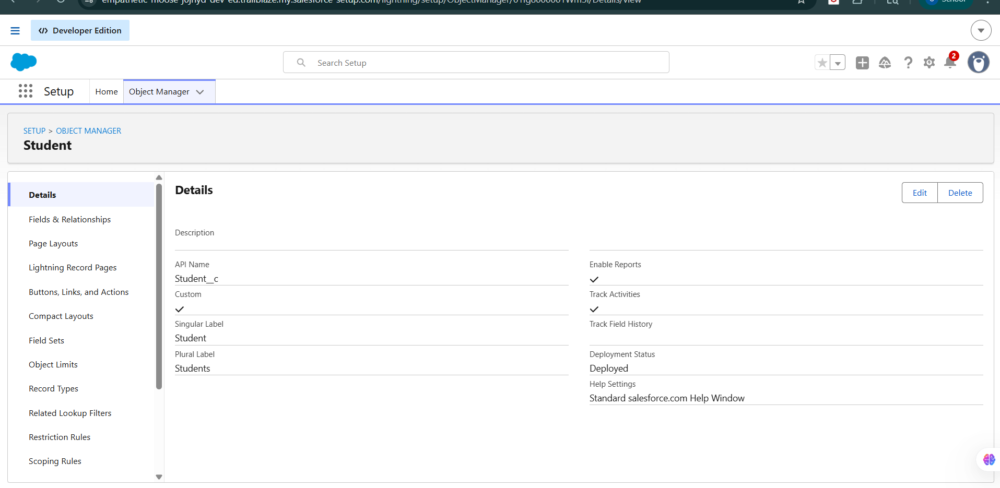
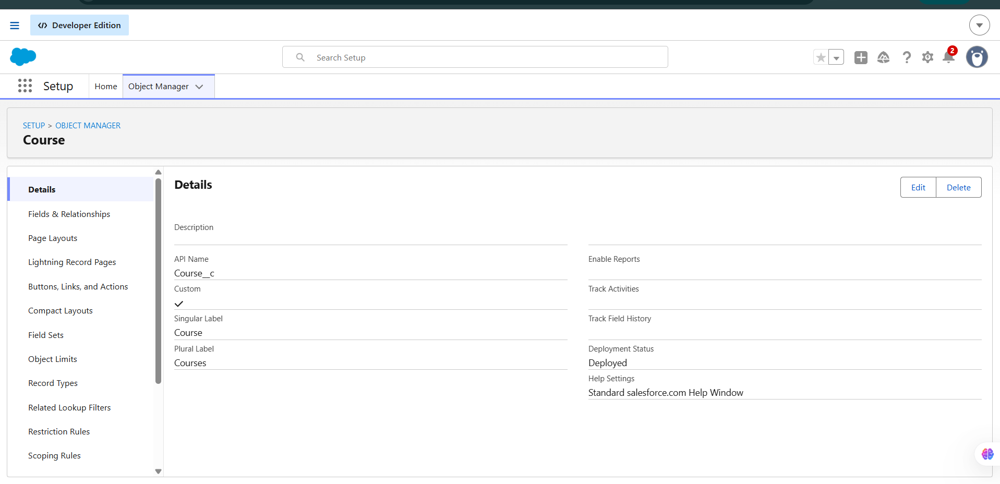
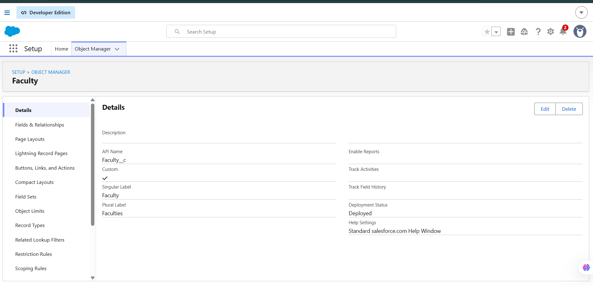
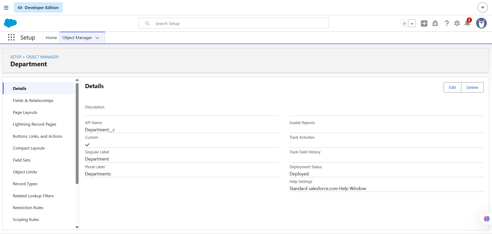
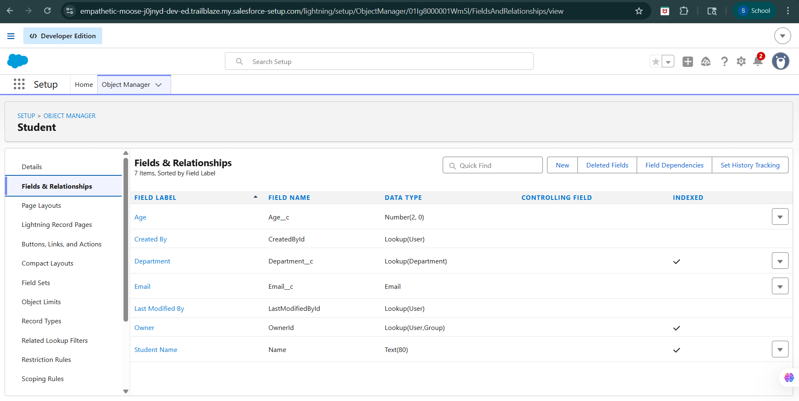
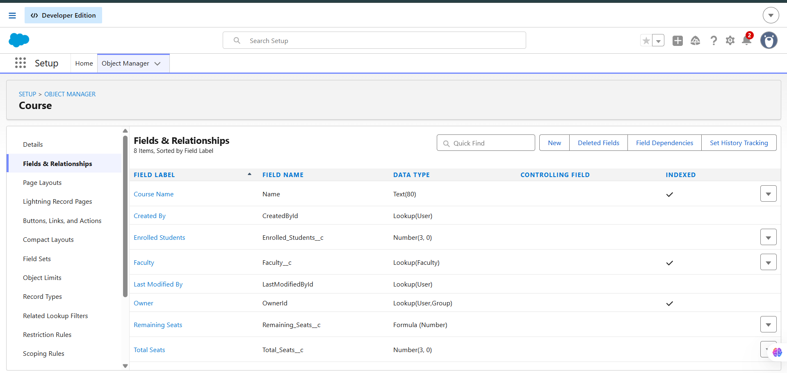
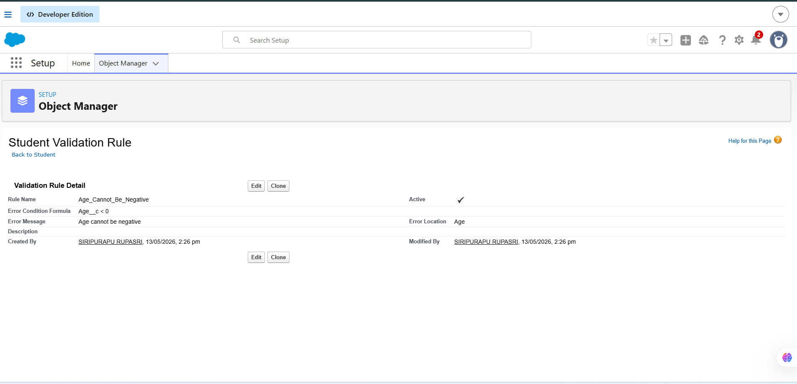
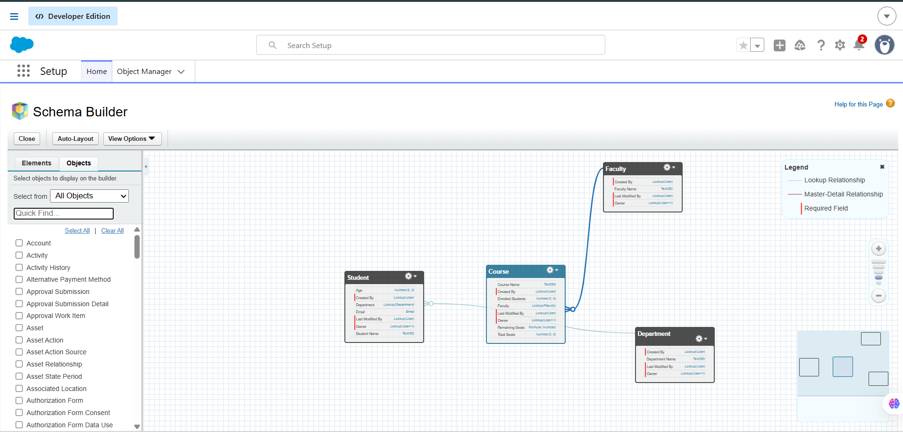

# 🚀 Day 3: Salesforce Data Modeling & Business Logic

## 📝 Summary

The goal of Day 3 was to understand how Salesforce stores and manages structured business data using Objects, Fields, Records, Relationships, Formula Fields, and Validation Rules.

The focus was on understanding enterprise data modeling concepts and implementing business logic without coding using Salesforce declarative tools.

A College Management System was conceptually designed to understand real-world relationships between business entities and how structured data is maintained inside enterprise applications.

---

# 🚀 Approach Taken

## Data Modeling

Studied Salesforce data modeling concepts including:

* Objects
* Fields
* Records
* Relationships
* Schema Builder

Explored how Salesforce organizes enterprise data using structured relationships instead of disconnected spreadsheets.

---

## Custom Object Creation

Created custom objects for a College Management System:

* Student
* Faculty
* Course
* Department

These objects were designed to simulate real-world academic management processes.

---

## Relationship Design

Created Lookup Relationships between objects to connect related business data.

### Relationships Implemented

| Object  | Relationship Type | Related Object |
| ------- | ----------------- | -------------- |
| Student | Lookup            | Department     |
| Faculty | Lookup            | Department     |
| Course  | Lookup            | Faculty        |

These relationships help maintain connected and reusable enterprise data.

---

# 📦 Objects, Fields and Records

## What is an Object?

An Object is a database table used to store related information.

Examples:

* Student
* Faculty
* Course

Objects contain:

* Records
* Fields

---

## What is a Field?

A Field is like a column in a database table.

Examples:

* Student Name
* Email
* Age
* Department

Fields store specific pieces of information.

---

## What is a Record?

A Record is a single entry inside an object.

Example:

| Student Name | Age | Department |
| ------------ | --- | ---------- |
| Rupa         | 19  | AIML       |

Each row represents one record.

---

# 📱 App vs Object vs Record vs Field

| Component | Meaning                                    |
| --------- | ------------------------------------------ |
| App       | Collection of related features and objects |
| Object    | Database table                             |
| Record    | Single row of data                         |
| Field     | Column storing specific information        |

---

# 📦 Standard vs Custom Objects

## Standard Objects

Prebuilt Salesforce objects provided by Salesforce.

Examples:

* Account
* Contact
* Lead
* Opportunity

---

## Custom Objects

Objects created based on business requirements.

Examples:

* Student
* Faculty
* Course
* Department

Custom objects allow businesses to build domain-specific systems.

---

# 🏫 College Management System Data Model

## Objects Created

* Student
* Faculty
* Course
* Department

---

## Relationships

| From Object | Relationship Type | To Object  |
| ----------- | ----------------- | ---------- |
| Student     | Lookup            | Department |
| Faculty     | Lookup            | Department |
| Course      | Lookup            | Faculty    |

---

# 🧮 Formula Fields

## 1. Remaining Seats

```text id="zx6l6v"
Total_Seats__c - Enrolled_Students__c
```

### Purpose

Automatically calculates available seats dynamically.

---

## 2. Percentage

```text id="mh4m3p"
(Obtained_Marks__c / Total_Marks__c) * 100
```

### Purpose

Automatically calculates student percentage accurately.

---

## 3. Full Name

```text id="f0j3m5"
First_Name__c & " " & Last_Name__c
```

### Purpose

Automatically combines first and last names consistently.

---

# ✅ Validation Rules

## 1. Student Age Cannot Be Negative

```text id="4w2s8v"
Age__c < 0
```

### Prevents

Invalid age entries.

---

## 2. Email Cannot Be Empty

```text id="6evl4u"
ISBLANK(Email__c)
```

### Prevents

Missing student contact information.

---

## 3. Enrolled Students Cannot Exceed Total Seats

```text id="puz0rq"
Enrolled_Students__c > Total_Seats__c
```

### Prevents

Course overbooking.

---

# 🔄 Formula Fields vs Validation Rules

| Formula Fields                  | Validation Rules                  |
| ------------------------------- | --------------------------------- |
| Used for automatic calculations | Used for restricting invalid data |
| Generates dynamic values        | Prevents incorrect record saving  |
| Example: Percentage             | Example: Age cannot be negative   |

---

# 💡 Why Structured Data Matters

Companies cannot efficiently manage enterprise operations using random spreadsheets because:

* Data becomes duplicated
* Relationships are lost
* Reports become inaccurate
* Manual calculations cause errors
* Collaboration becomes difficult
* Data inconsistency increases

Structured enterprise systems provide:

* Connected data
* Better reporting
* Automation
* Scalability
* Security
* Accurate business insights

This is why enterprise platforms like Salesforce use structured relational data models.

---

# 📸 Screenshots

## Student Object Creation


## Course Object Creation


## Faculty Object Creation


## Department Object Creation


## Student Fields & Relationships


## Course Fields & Relationships


## Validation Rules


## Schema Builder


---

# 💡 Learnings

* Understood Salesforce data modeling concepts.
* Learned how Objects, Fields, and Records work together.
* Explored Lookup Relationships and connected enterprise data.
* Understood the difference between Standard and Custom Objects.
* Learned how Formula Fields automate calculations.
* Learned how Validation Rules prevent invalid data.
* Explored Schema Builder for visual data modeling.
* Understood why structured enterprise data is important.
* Learned how Salesforce enables no-code business logic implementation.

---

# ✅ Final Outcome

Successfully understood Salesforce data modeling, relationships, Formula Fields, and Validation Rules through Trailhead learning, schema design, object creation, and enterprise system thinking using a College Management System example.
