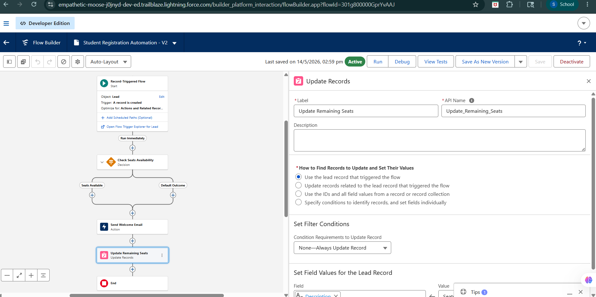

# 🚀 Day 4: Salesforce Flow Builder & Business Process Automation

## 📝 Summary

The goal of Day 4 was to understand how Salesforce automates enterprise business processes using Flow Builder and no-code automation tools.

The focus was on learning how businesses reduce repetitive manual work using Salesforce Flows, automation logic, record-triggered processes, actions, and workflow-based decision making.

A College Management System was used as a real-world example to design automation workflows and understand how enterprise systems improve productivity, consistency, and operational efficiency.

---

# 🚀 Approach Taken

## Business Process Automation

Studied how organizations automate repetitive tasks to:

* Save employee time
* Reduce human errors
* Improve consistency
* Increase productivity
* Improve customer and user experience

Understood the difference between manual processes and automated workflows inside enterprise systems.

---

# 🔄 Salesforce Flow Builder

## What is Flow Builder?

Flow Builder is Salesforce’s declarative no-code automation tool used to automate business workflows visually using flowcharts instead of programming.

Using Flow Builder, businesses can:

* Create records automatically
* Update records automatically
* Send notifications
* Trigger approvals
* Guide users through screens
* Automate backend operations

---

# 📦 Types of Flows in Salesforce

## 1. Screen Flow

Interactive flow that collects user input through screens.

### Example

* Student registration form
* Fee payment form
* Course enrollment process

### Features

* User interaction
* Forms and input fields
* Guided business processes

---

## 2. Record-Triggered Flow

Runs automatically when records are created, updated, or deleted.

### Example

* Automatically send fee reminder when due date approaches
* Update remaining seats when a student enrolls
* Notify faculty when course capacity is full

### Features

* Fully automated
* No user interaction needed
* Runs in background

---

## 3. Autolaunched Flow

Runs automatically through buttons, APIs, or other automations.

### Example

* Generate student ID automatically
* Create onboarding tasks automatically

---

## 4. Schedule-Triggered Flow

Runs automatically at a scheduled date and time.

### Example

* Daily attendance reminders
* Monthly fee due notifications

---

# ⚙️ Flow Builder Components

## Elements

Flow steps that perform actions.

### Types of Elements

| Element Type | Purpose                      |
| ------------ | ---------------------------- |
| Interaction  | User interaction             |
| Data         | Create/update/delete records |
| Logic        | Decisions and conditions     |

---

## Connectors

Connect elements and define the execution path.

---

## Resources

Store data used inside flows.

### Examples

* Variables
* Formulas
* Constants
* Text Templates

---

# 📚 Variables in Flow Builder

Variables temporarily store information during flow execution.

## Variable Types

| Type    | Purpose                         |
| ------- | ------------------------------- |
| Text    | Store text values               |
| Number  | Store numeric values            |
| Boolean | True/False values               |
| Date    | Store dates                     |
| Record  | Store entire Salesforce records |

---

# 🔍 Working with Salesforce Records

## Create Records

Used to automatically create Salesforce records.

### Example

* Create student onboarding task
* Generate support ticket automatically

---

## Update Records

Used to automatically update existing records.

### Example

* Update course remaining seats
* Mark fee payment status

---

## Get Records

Retrieves Salesforce data for automation logic.

### Example

* Check course seat availability
* Retrieve student information
* Get faculty details

---

## Delete Records

Deletes records automatically.

⚠️ Used carefully in enterprise systems.

---

# 🧠 Flow Logic & Decision Making

Salesforce Flows can make business decisions automatically.

### Example

If:

* Remaining seats = 0

Then:

* Notify faculty
* Prevent further registrations

This helps businesses automate rule-based operations.

---

# 🏫 College Management System Automation Ideas

## 1. Auto Email After Student Registration

### Automation

Send confirmation email automatically after successful registration.

### Benefit

* Faster communication
* Improved student experience

---

## 2. Auto Update Remaining Seats

### Automation

Reduce available seats automatically when a student enrolls.

### Benefit

* Prevents overbooking
* Maintains accurate data

---

## 3. Notify Faculty When Course Is Full

### Automation

Automatically notify faculty members when enrollment reaches capacity.

### Benefit

* Faster decision making
* Better course management

---

## 4. Generate Student ID Automatically

### Automation

Automatically create student ID after admission approval.

### Benefit

* Eliminates manual entry
* Saves administrative time

---

## 5. Send Fee Payment Reminder

### Automation

Automatically remind students before fee deadlines.

### Benefit

* Improves payment collection
* Reduces manual follow-up

---

# 🔄 Flow Design Thinking

## Selected Process

Auto Update Remaining Seats

---

## Flow Structure

### Trigger

Student enrollment record is created.

↓

### Step 1

Get Course Record

↓

### Step 2

Retrieve current remaining seats

↓

### Decision

Are seats available?

* Yes → Continue
* No → Stop enrollment and notify admin

↓

### Step 3

Update remaining seats count

↓

### Final Action

Send enrollment confirmation email

---

# 🔁 Manual vs Automated Process

## Process Chosen

Student Course Enrollment

---

## Manual Process

### Steps

1. Student submits request
2. Admin checks available seats manually
3. Admin updates spreadsheet
4. Admin confirms enrollment manually
5. Admin sends confirmation email manually

---

## Problems in Manual Process

* Time consuming
* Human errors
* Duplicate entries
* Incorrect seat counts
* Delayed communication
* Difficult to scale

---

## Automated Salesforce Process

### Salesforce Automation

* Automatically checks available seats
* Updates seat count instantly
* Prevents over-enrollment
* Sends automatic confirmation email
* Stores all data centrally

---

## Benefits of Automation

* Faster processing
* Accurate data
* Reduced manual effort
* Better user experience
* Improved operational efficiency

---

# 💡 Why Automation Matters in Enterprise Systems

Enterprise organizations manage thousands of records and repetitive operations daily.

Without automation:

* Employees waste time
* Human errors increase
* Data inconsistency occurs
* Productivity decreases
* Customer experience suffers

With Salesforce automation:

* Business processes become faster
* Operations become standardized
* Data remains accurate
* Employees focus on higher-value work
* Systems become scalable and efficient

Automation is one of the most important aspects of modern enterprise software systems.

---

# 📸 Screenshots

## Complete Student Registration Automation Flow

---

# 💡 Reflection

## Why should companies automate repetitive business processes?

Companies automate repetitive business processes because manual operations consume time, increase operational costs, and introduce human errors.

Automation helps organizations:

* Improve efficiency
* Increase consistency
* Reduce repetitive work
* Improve customer experience
* Maintain accurate enterprise data
* Scale operations effectively

No-code automation tools like Salesforce Flow Builder allow businesses to build powerful workflows without requiring advanced programming knowledge, making automation faster and more accessible.

---

# ✍️ Reflective Questions

## 1. Why do companies automate workflows?

To save time, improve consistency, reduce errors, and increase productivity.

---

## 2. What problems happen with manual processes?

Manual processes cause delays, human errors, duplicate work, inaccurate data, and poor scalability.

---

## 3. Difference between Screen Flow and Record-Triggered Flow?

| Screen Flow               | Record-Triggered Flow |
| ------------------------- | --------------------- |
| Requires user interaction | Runs automatically    |
| Displays screens/forms    | Runs in background    |
| User-driven               | Event-driven          |

---

## 4. Why is no-code automation powerful?

It allows businesses to automate processes quickly without needing software developers.

---

## 5. When should automation be avoided?

Automation should be avoided when processes frequently change, require human judgment, or are not clearly defined.

---

## 6. How does automation improve consistency and productivity?

Automation performs tasks the same way every time, reducing mistakes and increasing operational speed.

---

# 💡 Learnings

* Understood Salesforce Flow Builder fundamentals
* Learned different types of Salesforce Flows
* Explored automation concepts in enterprise systems
* Learned how flows interact with Salesforce records
* Understood automation logic and decision making
* Explored no-code business process automation
* Understood differences between manual and automated workflows
* Learned how automation improves productivity and consistency
* Applied business analyst thinking to workflow design

---

# ✅ Final Outcome

Successfully understood Salesforce Flow Builder, business process automation, flow types, automation logic, record-based automation, and enterprise workflow optimization using College Management System examples and Salesforce declarative automation tools.
