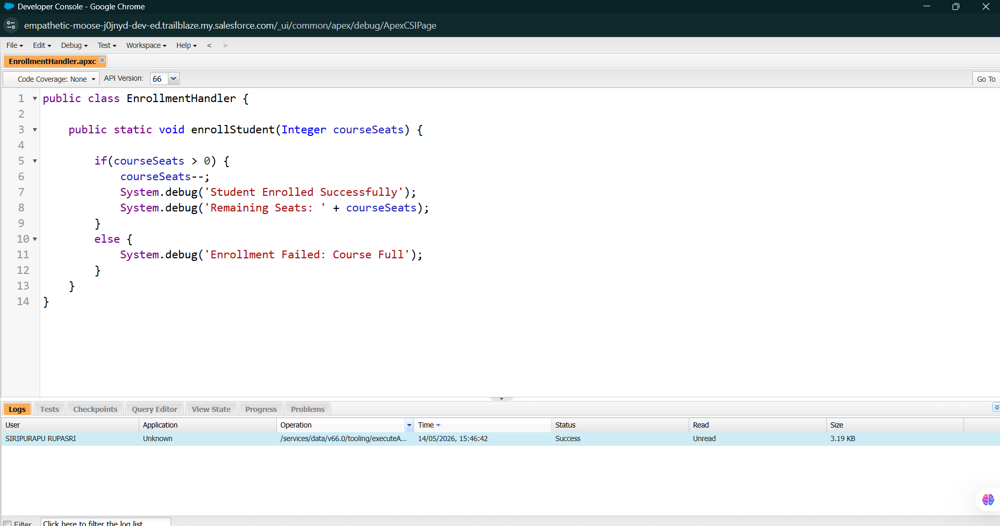
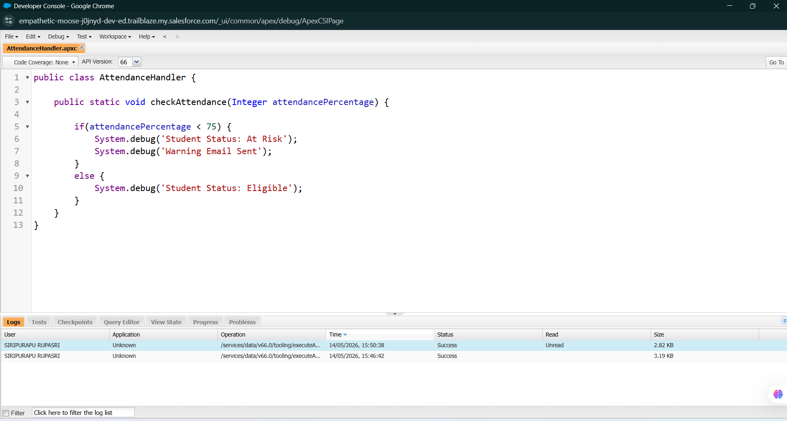

# Day 5: Apex Introduction & Business Logic in Salesforce

## Summary

The goal of Day 5 was to understand the fundamentals of Apex programming in Salesforce and how enterprise applications combine declarative tools with custom programming logic.

The focus was on learning:

* What Apex is
* Why Salesforce needs programming in addition to Flows
* Basic Apex syntax and logic building
* DML operations
* SOQL and SOSL basics
* How Apex connects to enterprise business logic

A College Management System was again used as a real-world example to understand how custom logic can automate and control business operations inside Salesforce.

---

# What is Apex?

Apex is Salesforce’s object-oriented programming language used to build custom business logic and backend automation on the Salesforce Platform.

Apex is similar to Java and allows developers to:

* Write custom business rules
* Automate complex processes
* Integrate external systems
* Perform database operations
* Create scalable enterprise applications

Unlike Flows, Apex provides full programming flexibility for advanced logic and automation.

---

# Why Apex is Needed in Salesforce

Salesforce already provides no-code tools like:

* Flows
* Validation Rules
* Process Builder

However, some business problems become too complex for declarative tools.

Apex is needed when:

* Complex calculations are required
* Multiple systems need integration
* Advanced conditions and validations are needed
* Large-scale automation must be handled efficiently

---

# Declarative vs Programmatic Development

| Declarative (No-Code)   | Programmatic (Apex Code) |
| ----------------------- | ------------------------ |
| Built using clicks      | Built using code         |
| Easy to configure       | Flexible and powerful    |
| Faster for simple tasks | Better for complex logic |
| Limited customization   | Full control over logic  |
| Flow Builder            | Apex Classes & Triggers  |

---

# Topics Learned

## Apex Basics

Learned:

* Variables
* Methods
* Classes
* Conditional Statements
* Loops
* Debug Statements

### Example

```apex
Integer seats = 10;

if(seats > 0) {
    System.debug('Seats Available');
}
```

---

# Apex Classes

Apex classes are reusable containers that hold methods and business logic.

### Example

```apex
public class CollegeManagement {

    public static void welcomeStudent() {
        System.debug('Welcome to Salesforce Apex');
    }
}
```

---

# Conditional Logic

Conditional statements allow systems to make business decisions automatically.

### Example

```apex
if(attendance < 75) {
    System.debug('Warning Email Sent');
}
```

---

# Loops in Apex

Loops are used to repeat operations efficiently.

### Example

```apex
for(Integer i = 1; i <= 5; i++) {
    System.debug(i);
}
```

---

# DML Operations

DML (Data Manipulation Language) operations are used to work with Salesforce records.

Operations learned:

* Insert
* Update
* Delete

### Example

```apex
Account acc = new Account(Name='ABC College');
insert acc;
```

---

# SOQL (Salesforce Object Query Language)

SOQL is used to retrieve records from Salesforce objects.

### Example

```apex
Account[] accounts = [SELECT Name FROM Account];
```

Purpose:

* Read Salesforce data
* Filter records
* Retrieve related records

---

# SOSL (Salesforce Object Search Language)

SOSL is used to search text across multiple Salesforce objects.

### Example

```apex
List<List<SObject>> searchList =
[FIND 'Smith' IN ALL FIELDS
RETURNING Contact(Name), Lead(Name)];
```

Purpose:

* Search multiple objects together
* Find records quickly using keywords

---

# College Management System Integration

## Objects Used

| Object  | Purpose                   |
| ------- | ------------------------- |
| Student | Store student information |
| Course  | Store course details      |
| Faculty | Store faculty information |

---

# Relationships

| Relationship     | Purpose                    |
| ---------------- | -------------------------- |
| Student ↔ Course | Student enrollment         |
| Course → Faculty | Faculty assigned to course |

---

# Validation Example

### Rule

Student email must not be empty during registration.

### Purpose

* Prevent incomplete records
* Maintain accurate student data

---

# Flow Automation Example

### Automation

Automatically send confirmation email after successful enrollment.

### Benefits

* Faster communication
* Reduced manual work
* Better student experience

---

# Apex Business Logic Examples

## Enrollment Handler Logic

```apex
public class EnrollmentHandler {

    public static void enrollStudent(Integer courseSeats) {

        if(courseSeats > 0) {
            courseSeats--;
            System.debug('Student Enrolled Successfully');
            System.debug('Remaining Seats: ' + courseSeats);
        }
        else {
            System.debug('Enrollment Failed: Course Full');
        }
    }
}
```

### Business Purpose

* Prevent over-enrollment
* Maintain accurate seat count
* Apply custom enrollment rules

---

# Attendance Handler Logic

```apex
public class AttendanceHandler {

    public static void checkAttendance(Integer attendancePercentage) {

        if(attendancePercentage < 75) {
            System.debug('Student Status: At Risk');
            System.debug('Warning Email Sent');
        }
        else {
            System.debug('Student Status: Eligible');
        }
    }
}
```

### Business Purpose

* Monitor attendance automatically
* Notify students with low attendance
* Apply academic eligibility rules

---

# Cases Where Flow is NOT Enough

## 1. Complex Fee Calculation

### Why Apex?

Requires multiple conditions, discounts, penalties, and dynamic calculations.

---

## 2. External Payment Gateway Integration

### Why Apex?

Requires API calls and real-time communication with external systems.

---

## 3. Advanced Student Eligibility Logic

### Why Apex?

Complex rules involving attendance, fees, grades, and department conditions are difficult in Flow alone.

---

# Pseudocode Examples

## Example 1

```text
IF seats are full
THEN block registration
```

## Example 2

```text
IF attendance < 75%
THEN notify student
```

## Example 3

```text
IF fees are pending
THEN block exam access
```

---

# Reflection

## Why can’t all enterprise logic be built using only clicks and configuration?

Enterprise systems often require:

* Complex decision making
* Dynamic calculations
* External integrations
* Large-scale automation
* Advanced validations

Declarative tools are excellent for simple automation, but large enterprise applications eventually require programming for flexibility, scalability, and customization.

Apex helps Salesforce developers build enterprise-grade solutions that go beyond the limits of no-code tools.

---

# Screenshots

## Enrollment Handler Apex Class



## Attendance Handler Apex Class



---

# Learning Resources Completed

## Trailhead Modules

* Apex & .NET Basics
* Apex Basics & Database

## Video Topics Covered

* Introduction to Apex
* Variables & Loops
* Classes & Methods
* Triggers Overview
* SOQL & SOSL Basics
* Collections & Exception Handling

---

# Key Learnings

* Understood why Apex exists in Salesforce
* Learned difference between Flow and Apex
* Explored declarative vs programmatic development
* Learned Apex syntax fundamentals
* Practiced DML operations
* Learned SOQL and SOSL basics
* Understood business logic implementation
* Connected Salesforce concepts using College Management System examples
* Understood enterprise automation thinking

---

# Final Outcome

Successfully understood the fundamentals of Apex programming, Salesforce database operations, business logic development, SOQL/SOSL querying, and the role of custom programming in enterprise Salesforce applications using real-world College Management System scenarios.

